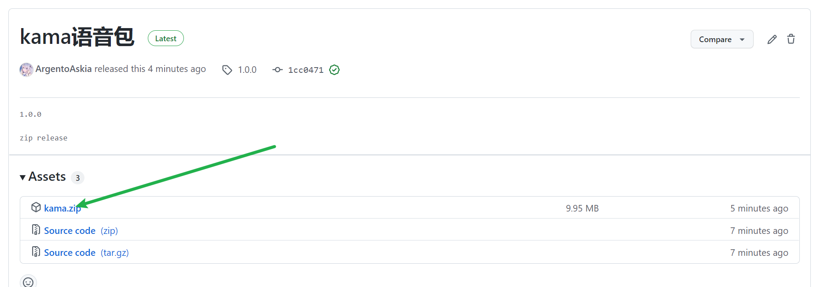
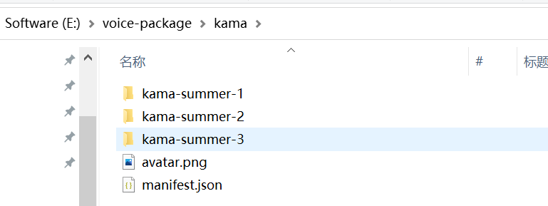
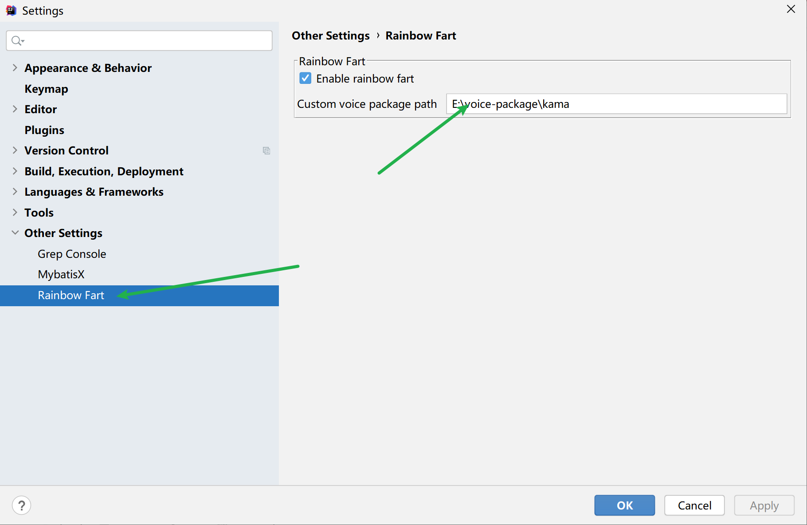

<h1 align="center">Rainbow Fart Kama</h1>

`FGO`伽摩语言包，音源来源自[`Mooncell`](https://fgo.wiki/w/迦摩(Avenger)#.E8.AF.AD.E9.9F.B3)。

- `master`打过的最丢人的一届`beast`！
- 帮人牵线反被烧，这个爱神真做不了！

### 音源说明

全部音源来源自`Mooncell`，部分音源比较长，没来得及切割。

关键字主要是`Java`为主，当然`C`、`CPP`、`Javascript`，也涉及到（`Javascript`的比较少）。

后期会整理更多语言的啦~~`QAQ`

### 使用介绍

在`release`页面中下载`kama.zip`：[传送门](https://github.com/ArgentoAskia/rainbow-fart-kama/releases/tag/1.0.0)

然后解压到某个目录，注意解压的路径，解压出来目录结构是这样的：

最后在`idea`的插件中：把语音包的根路径配置上就好：

最后重启`idea`就可以了